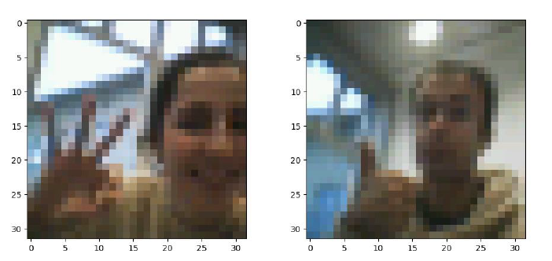
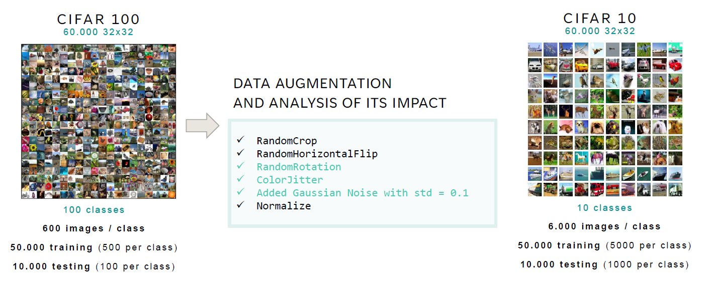
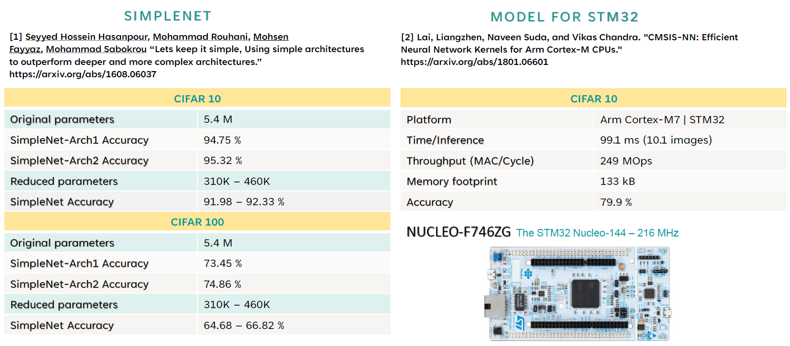
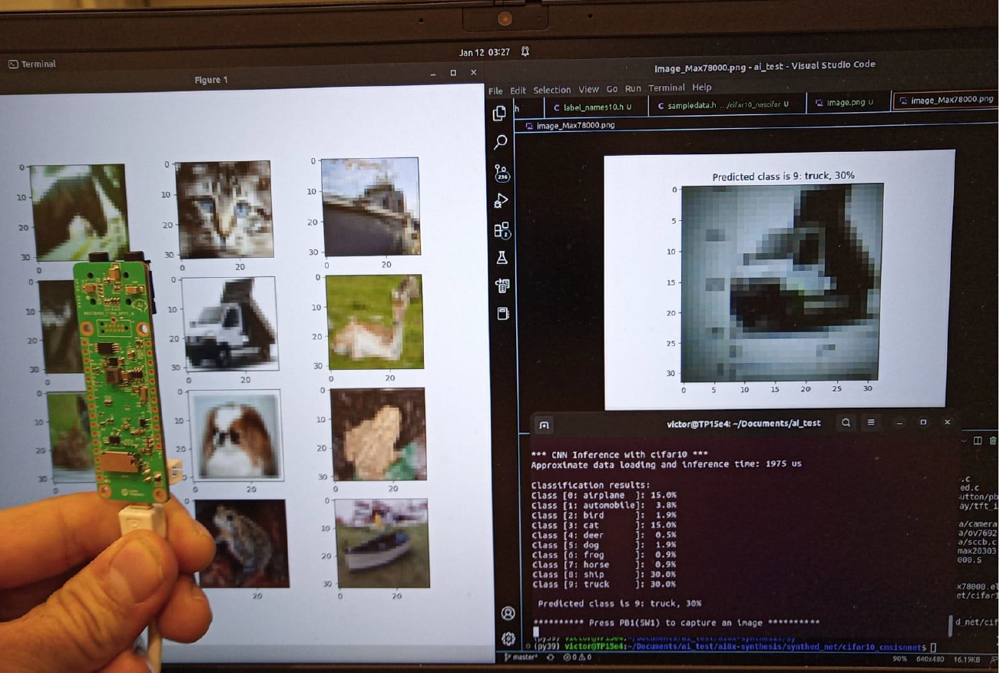

# Machine Learning on MCU - Image Classifier

This repo contains @visaub's & @blclo's results for ML on Microcontrollers course at @ETH Zurich.
#### The main goal of the project is achieving the **right trade-off** between **model accuracy, latency and power consumption** given the limitations of the MCU. 

It consists of an **Image clasifier trained on Cifar 10&100 and implemented on a microcontroller with a neural accelerator - [Maxim78000](https://github.com/MaximIntegratedAI/MaximAI_Documentation/blob/master/MAX78000_Feather/README.md)**

The code found on this repo contains the necessary files to run the models and try out our results.

## File Organization
------------

    ├── README.md          <- The top-level README for developers using this project.
    │
    ├── mcu_demo_setup           <- python scripts for MCU demo
    ├── cifar10_cmsisnnet_EclipseSDK    <- C files to be used with Eclipse SDK
    ├── media          <- pictures in README.md
    ├── logs.zip       <- ZIP file including results from models runs
    └── src                <- Source code for use in this project.
        ├── data           <- Scripts to download or generate data
        │   └── cifar100.py
        │
        └── policies       <- Required in Bash Files SetUp
        └── models         <- Scripts to train models modified from Maxim Integrated Products 

## Datasets used

## State-Of-The-Art
Before our project we analysed the current State Of The Art in Image Classification on MCUs. Two main papers were found, with results below:

## Implementation on MAXIM78000
To be explained soon.

## Model Architecture
To be explained soon.

## Results CIFAR 10
- **CMSISNNET is 50.3 times faster ran in MAXIM 78000** than in the STM 32 Nucleo 144 used by the paper.
    - We are able to classify 507 6 images/s with an accuracy of 87.15%
    - The paper presented 10.1 images/s with an accuracy of 79.9%

- NASCIFARNET showed an improvement in accuracy after performing data augmentation 
    - We confirmed QAT yields a better accuracy compared to PTQ, specifically +4.25%

- SIMPLENET showed lower accuracy than the model presented by the paper -4%
    - We have used 50 epochs There is no information about the paper’s model

An example of the setup using the camera and the model classification can be seen in the image below.

The full presentation can be found under the [final_presentation.pdf](https://github.com/blclo/MLonMicrocontrollers/blob/main/final_presentation.pdf) file.
